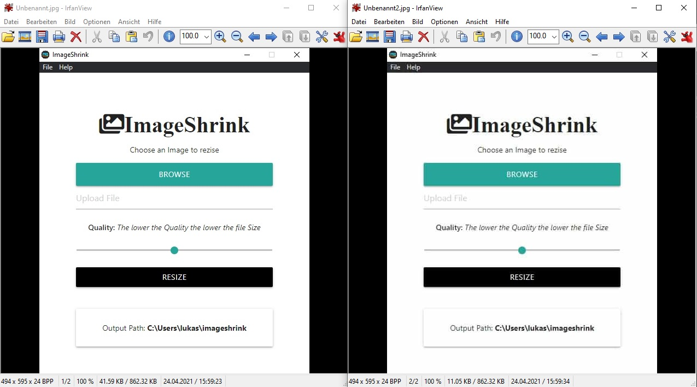

# ImageShrink v1.0.1

Resize Images to a fraction of the original size without big quality loss for Windows, Mac and Linux.
This is an extremly useful tool for every webdeveloper or generally everyone who concerns about the filesize of images.

## How to run:

- clone repo
- run:
  > yarn install
  > or
  > npm install
- depending on your OS run one of these:

  > npm run package-win

  > npm run package-mac

  > npm run package-linux

- a 'release-builds'-folder with an executable is created

## What you can expect

Here are two screenchots of the programm. The one on the right is the same as the left one but crunched down with ImageShrink to 11kB instead of the original 44kB. As you can see you can use the slider to affect the quality/file-size impact. This example got compressed with the slider at quality-setting of exactly 50%. Note, that settting 99% already causes a significant file-size-loss with almost no human-eye catchable impact.

For comparison the screenshots are also inside this repository in assets/readme-assets/

This Program is possible because of the following node-packages:

- [imagemin](https://www.npmjs.com/package/imagemin)
- [imagemin-pngquant](https://www.npmjs.com/package/imagemin-pngquant)
- [imagemin-mozjpg](https://www.npmjs.com/package/imagemin-mozjpeg)

So really all credits and many kudos go to [sinresorhus](https://www.npmjs.com/~sindresorhus) who also creatd the [slash](https://www.npmjs.com/package/slash)-package I used for easier file-path-handling

Also kudos and many thanks to [Brad Traversy](https://www.youtube.com/channel/UC29ju8bIPH5as8OGnQzwJyA/videos) who's udemy-course made me able to do this. Also a very good source of free and helpful web-dev-tutorials on YouTube.

Feel free to use this as you please and have fun!
